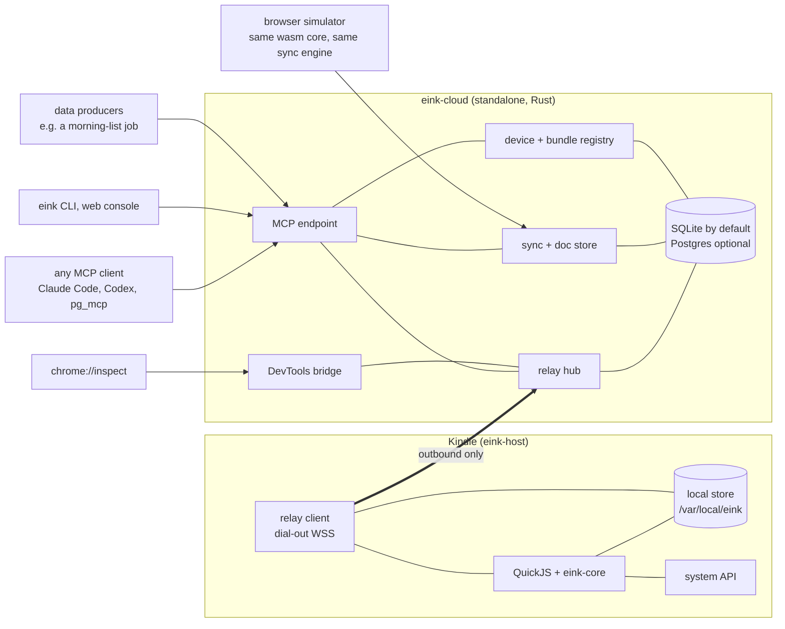

# eink-ui as a platform

A proposal. Today eink-ui is one Kindle, one app, one cloud endpoint and a debug port that only
works on the home LAN. This document describes how the same pieces become a platform where an
e-ink device is a dumb, durable screen; the cloud holds every app, every document and every
debugging session; and any agent or human can reach both through MCP.

The seven goals, in one line each:

| goal | the platform answer |
|---|---|
| cloud loading | the device holds a URL and a token; a signed manifest says which bundle to run |
| remote debugging from any agent | the device dials out to a relay; MCP tools drive the relay |
| app data via MCP | documents live in eink-cloud's store; MCP writes ops, devices sync them |
| debugging via MCP | logs, eval, scene tree, screenshot, synthetic input, a cloud simulator |
| offline first | an op log with deterministic merge, one implementation shared by device, sim and server |
| system controls | a typed capability API surfaced as hooks and components, mockable in the sim |
| custom components | components are plain React over three primitives; stories are discovered automatically |

## 1. Principles

1. **The device is dumb and durable.** The host binary changes rarely. It knows how to paint,
   read input, store documents, talk to one URL and stay alive. Everything else is a bundle it
   downloads.
2. **The cloud is the brain, and anyone can run it.** Bundles, documents, device state, debug
   sessions and the MCP surface live in one standalone service with no dependency on anything
   but its own store. Nothing needs the LAN.
3. **Everything is reachable by an agent.** Every capability has an MCP tool and a CLI verb that
   call the same API. A human with a browser and an agent with any MCP client see the same things.
4. **Local first.** The device renders from its own store and never blocks on the network. Sync
   is a background job in the host, and the JavaScript app only sees events.
5. **Components are just JavaScript.** Adding a component never touches Rust. Adding a primitive
   (box, text, image) is rare and deliberate.

## 2. Shape



Three deployables:

- **eink-host** on the device (exists; gains a store, a sync worker, a relay client and the
  system API).
- **eink-cloud**, one Rust service that anyone can stand up: a single static binary or
  container, SQLite in a volume by default, Postgres when you have one. It is the relay, the
  sync server, the registry, the MCP endpoint and, later, the DevTools bridge. Its MCP endpoint
  is standard streamable HTTP with bearer tokens, so Claude Code, Codex or pg_mcp add it as a
  server the same way they add any other. Sam will register it in pg_mcp; the platform never
  knows or cares.
- **the SDK**: `@eink-ui/react`, `@eink-ui/components`, `@eink-ui/sync`, `@eink-ui/system`,
  `@eink-ui/sim`, and `create-eink-app`.

## 3. Cloud loading

The device stores two things: `cloud_url` and a device token. At start, on every wake and on a
five-press reload it asks `GET /manifest?device=…`:

```json
{ "app": "todo", "channel": "stable", "version": "0.14.0",
  "bundle": { "url": "…/bundles/todo/0.14.0/app.js", "sha256": "…", "bytes": 123304 },
  "min_host": "0.3.0", "check_in_minutes": 60 }
```

- **Channels** (`stable`, `dev`) are set per device from MCP. Testing a change on the real
  device is `eink_deploy(app, channel: "dev")` followed by a reload; no cable, no LAN.
- **ETag** on the manifest makes the common case one small request and no download.
- **Atomic swap with rollback.** The host keeps `current` and `last-good`. A bundle that throws
  during load, or crashes the host twice within a minute, is demoted and `last-good` runs. The
  event is reported on the next check-in and shows the error badge. This is the "bulletproof"
  requirement made structural.
- **Check-in cadence** is a policy in the manifest, so battery versus reachability is a knob set
  from the cloud, not a constant in the binary.

## 4. Reachability: the device dials out

Inbound connections were the wrong shape: the Kindle sits behind a firewall and NAT, sleeps most
of the day, and changes IP. The platform inverts it. While the device is awake it holds one
outbound WebSocket to the relay:

```
device → hello    {device, host, app, bundle_sha, battery, charging, wifi}
cloud  → cmd      {id, kind, …}            kind ∈ eval | logs | tree | screenshot | tap | key |
                                            reload | keep_awake | sync | set_channel
device → result   {id, ok, data}
device → log      {ts, line}               streamed while a session is attached
device → sleeping {next_check_in}          sent before suspend, then the socket closes
```

**Sleep is the honest limit.** A suspended Kindle has Wi-Fi off and cannot be pushed. So the
relay queues commands with a TTL and reports `last_seen` and `next_check_in` for every device.
Interactive debugging happens while the device is awake, and an agent can extend that window
(`keep_awake` for a number of minutes) during a session. The existing RTC wake becomes the
check-in tick: wake, connect, drain the queue, sync, update the bundle, sleep. The user can
always wake it with a button.

## 5. Debugging through MCP

Tools exposed by eink-cloud, callable from any MCP client:

| tool | what it returns |
|---|---|
| `eink_devices` | every device with `last_seen`, `next_check_in`, battery, app, bundle, awake |
| `eink_logs(device, tail \| since)` | recent host and app log lines (buffered on the device, mirrored to the cloud on check-in) |
| `eink_eval(device, js)` | result of an expression in the app context |
| `eink_tree(device)` | the scene tree: node ids, kind, rect, text, props, damage counters |
| `eink_screenshot(device)` | PNG of the framebuffer |
| `eink_tap(device, x, y)` / `eink_key(device, key)` | synthetic input |
| `eink_reload(device)` / `eink_deploy(app, channel, bundle)` / `eink_set_channel(device, channel)` | bundle control |
| `eink_keep_awake(device, minutes)` | extends the awake window |
| `eink_sim_render(bundle, docs, script)` | renders headlessly in the cloud with the wasm core: PNG plus tree, no device needed |

Two design points matter more than the list:

- **Structure over pixels.** The scene tree already exists in Rust with rectangles and text. An
  agent that can read the tree, hit-test a point and count damaged pixels per commit debugs
  layout and refresh behaviour far more cheaply than by looking at screenshots. Screenshots stay
  for the visual questions.
- **The simulator is a debugging target too.** `eink_sim_render` runs the same bundle and the
  same documents in the cloud. Most bugs reproduce there, and the device is only needed for
  hardware questions.

Chrome DevTools attaches to the relay, not the device. The parked CDP work moves cloud-side:
the relay speaks the DevTools protocol to Chrome and the device speaks the small protocol above.
`chrome://inspect` with the relay address gives a console, object inspection and a screencast
of a Kindle anywhere on the internet.

## 6. Data through MCP, offline first

### The model

Each app owns documents. A document is JSON with a version. Changes are **ops**, not documents:

```json
{ "op_id": "…uuid…", "doc": "days/2026-09-15", "path": ["sections", 1, "items", 2, "done"],
  "value": true, "hlc": "2026-09-15T14:02:11.412Z-0003-kindle-b013" }
```

- Every writer (device, simulator, MCP tool, SQL job) produces ops with a hybrid logical clock,
  so a wrong device clock cannot reorder history.
- Merge is **last-writer-wins per path** by HLC. This is deterministic, needs no coordination and
  is right for checkboxes, settings, lists and status. It is wrong for concurrent text editing,
  which this platform does not promise.
- The server assigns each op a sequence number; clients keep a cursor.

### The protocol

One endpoint, retry-safe:

```
POST /sync {device, app, cursor, ops: [...]}
→ {cursor, docs: [{id, body, version}]}
```

The server deduplicates by `op_id`, applies the ops, and returns every document changed since the
cursor, including the caller's own effects. The device applies the same merge to its local store
before the network answers, so the UI is optimistic and offline is the normal case, not an error
path. A partition, a retry or a duplicate cannot lose or double-apply a user action; that is what
"syncs perfectly" means here, and a test suite runs the engine against a fake server with
partitions to prove it.

### One implementation

The merge and the store live in one Rust crate, `eink-sync`. It compiles to the device, to the
server and to wasm for the simulator. The browser sim syncs against the real cloud with a device
id of its own, so Sam can watch a toggle in the browser appear on the Kindle at its next check-in.

### Where it lives on the device

`/var/local/eink/` , which survives USB mass-storage mode. `/mnt/us` disappears whenever the
cable is in, which is exactly when a user wants the app to keep working.

### The JavaScript API

```ts
const day = useDoc<TodoList>('days/2026-09-15');         // reactive, from the local store
const set = useMutate('days/2026-09-15');                // set(['sections', 1, 'items', 2, 'done'], true)
const { online, pending, lastSync } = useSync();          // for a status bar
```

No fetch in app code. The host does networking on its own threads and raises `sync:changed`.

### Writers in the cloud

- MCP: `eink_data_get(app, doc)`, `eink_data_patch(app, doc, path, value)`, `eink_data_put`,
  `eink_data_query`.
- HTTP: the same operations as a small REST API with a token, for scripts, cron jobs and
  webhooks that are not MCP clients.
- Anything that produces data is a client. Sam's morning list job lives in pg_mcp, reads his
  Linear, Calendar and GitHub tables, and writes one document through the MCP tool. The device
  picks it up at its first check-in of the day. Someone else's job can be a shell script and
  curl.

## 7. System controls as components

A typed capability API in the host, mirrored by mocks in the simulator:

```ts
system.battery()      → { percent, charging }             event 'battery'
system.network()      → { online, wifi, ip }              event 'network'
system.power          .keepAwake(ms) .sleepAfter(ms) .sleepNow() .schedule(at)
system.frontlight     .get() .set(0..24)
system.haptic         .tap() .pattern(id)
system.device         { model, serial, screen: { w, h, dpi }, host }
```

On top of it, components that every app wants and no app should reimplement: `StatusBar`,
`BatteryIcon`, `Clock`, `SyncIndicator`, `Dialog`, `Toast`, `PagedList` (an e-ink friendly list
that pages instead of scrolling), the existing `Keyboard`, and `Image` (see below).

The simulator gets knobs for battery, charging and connectivity, and stories declare the system
state they want (`system: { battery: 12, online: false }`), so the gallery shows every component
in every state that matters on a device.

## 8. Components anyone can add

- **Primitives**: `eink-box`, `eink-text`, and a new `eink-image` (1-bit and 8-bit bitmaps with
  dithering). Image unlocks icons, QR codes for pairing, sparklines and charts without native
  changes. Three primitives is the whole native surface.
- **Components** are React functions over primitives. They are publishable npm packages.
- **Stories** next to components (`*.stories.tsx`) are discovered by the build. The simulator is
  a static site, so a user's Pages or Vercel deploy is their own storybook automatically.
- **`create-eink-app`** scaffolds an app with the simulator, the gallery, tests, CI, and
  `npm run deploy`, which publishes a bundle to a channel on eink-cloud and the gallery to Pages.
- Later, a community gallery that aggregates stories from published packages.

## 9. What changes in the code

| area | today | platform |
|---|---|---|
| `crates/eink-kindle` | fetch app.js, debug port 2323 | plus `store`, `sync` worker, `relay` client, `system` capability API, manifest + rollback |
| new `crates/eink-sync` | | ops, HLC, LWW merge, local store; compiled for device, server, wasm |
| new `crates/eink-cloud` | | axum service: relay hub, `/sync`, `/manifest`, registry, MCP endpoint, DevTools bridge |
| `js/renderer` | reconciler | unchanged |
| `js/components` | 7 components | plus system components and `Image` |
| new `js/sync`, `js/system` | | hooks over host events; simulator mocks |
| `js/sim` | gallery + timing | plus device tab (live screen, logs, REPL over the relay) and system knobs |
| Vercel `kindle-todo` | list API + static bundle | retired: the list is a document in eink-cloud, the bundle is served by eink-cloud |
| MCP clients | | Claude Code, Codex and pg_mcp add eink-cloud as a server; nothing in eink-cloud references them |

## 10. Roadmap

Each phase is useful on its own and shrinks the cost of the next one.

1. **Reach.** eink-cloud with the relay, the registry and the MCP endpoint; the device dial-out
   client; tools `devices`, `logs`, `eval`, `tree`, `screenshot`, `tap`, `key`, `reload`,
   `keep_awake`; a container image and a one-line stand-up. Done when a fresh Claude Code
   session with only the eink MCP server can screenshot the Kindle and evaluate JavaScript on
   it while it is awake, and can see when it will next check in while it is asleep.
2. **Bundles.** Manifest, channels, hash check, atomic swap, crash-loop rollback, `deploy`. Done
   when a bundle that throws on load rolls back by itself and the event shows up in `eink_logs`.
3. **Data.** `eink-sync`, documents and ops in the store, `eink_data_*` and the REST twin, the
   todo app on `useDoc`, the morning job writing documents through MCP. Done when toggles made offline reach the cloud
   after reconnecting with nothing lost or doubled, proven by the partition test, and the browser
   sim shows the same list as the Kindle.
4. **System.** Capability API, hooks, system components, simulator knobs and stories.
5. **Ecosystem.** Package split, `create-eink-app`, per-user galleries, a docs site, and the
   DevTools bridge on the relay.

Sizes: 1 and 3 are the large ones. 2 and 4 are small. 5 is mostly packaging.

## 11. Limits worth saying out loud

- A suspended Kindle cannot be reached. Cadence is the trade against battery; the manifest sets it.
- Wi-Fi is the battery cost. The relay socket is held only while the device is awake for a user.
- The Kindle clock drifts. Ordering comes from HLCs and server sequence numbers, never from the
  device clock alone.
- `eval` is root on the device. eink-cloud has two kinds of tokens, device and agent, and every
  side-effecting tool needs an agent token. Human approval is the MCP client's job; pg_mcp adds
  it, Claude Code prompts, a script has none.
- The relay needs a long-lived process with WebSockets, so eink-cloud is a container, not a
  serverless function. Fly, a VPS, a Raspberry Pi or a laptop all work.
- QuickJS is single-threaded, so all I/O stays in host threads and the app only receives events.
- Field-level LWW is not collaborative text editing. That is out of scope.

## 12. Standing it up

Decided: eink-cloud is its own thing, with no dependency on pg_mcp or on any particular host.
This is what "anyone can stand it up" means in practice.

```sh
docker run -d -p 8080:8080 -v eink:/data \
  -e EINK_PUBLIC_URL=https://eink.example.com \
  -e EINK_ADMIN_TOKEN=change-me \
  ghcr.io/sberan/eink-cloud
```

- **One process, one volume.** SQLite in `/data` holds devices, bundles, documents, ops and
  logs. Set `EINK_DATABASE_URL` to use Postgres instead. Nothing else to install.
- **Two kinds of tokens.** `eink token device --name kindle` prints a device token that goes into
  `keys.conf` next to the URL; `eink token agent --name claude-code` prints an agent token for an
  MCP client. Both are revocable from MCP and from the CLI.
- **Standard MCP.** `https://eink.example.com/mcp` with `Authorization: Bearer <agent token>`.
  Adding it to Claude Code is one `claude mcp add` line; adding it to pg_mcp is one row in its
  servers table. Codex, Cursor and the rest work the same way.
- **Bundles come from anywhere.** `eink deploy dist/app.js --app todo --channel dev` uploads to
  eink-cloud, which serves it to devices. CI can do the same with an agent token.
- **A public relay is optional.** A device only needs outbound HTTPS to the public URL. A
  laptop on the same Wi-Fi with a tunnel works for development; a small VPS works for life.
- **Single tenant by design.** One instance is one person's or one team's devices. Multi-user
  accounts are not a goal; a second team runs a second container.
